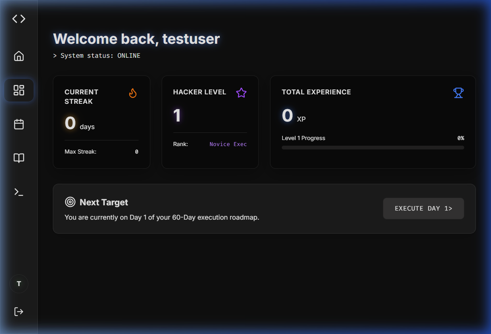
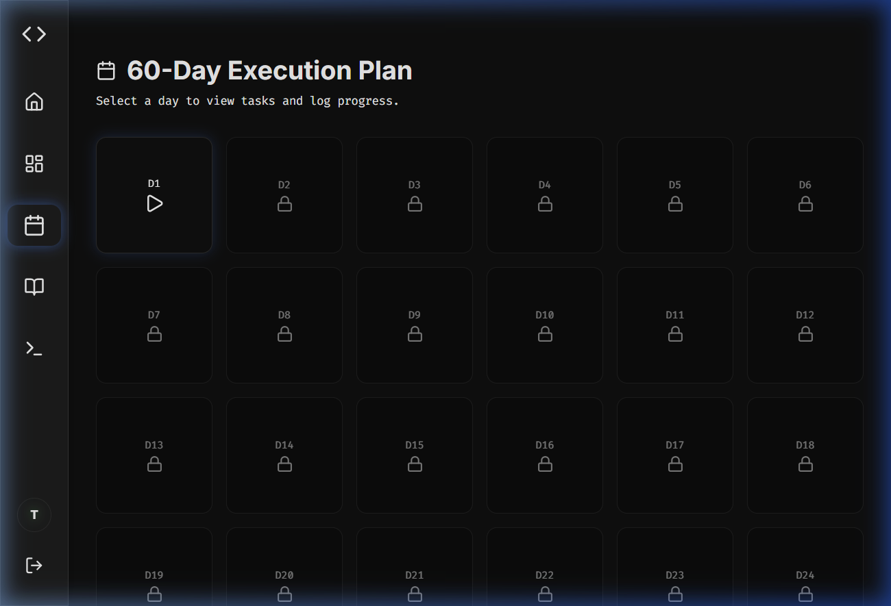
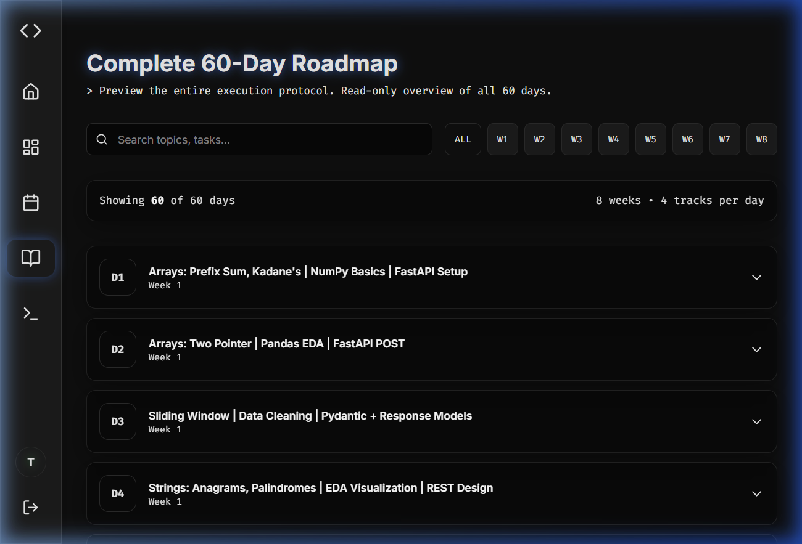
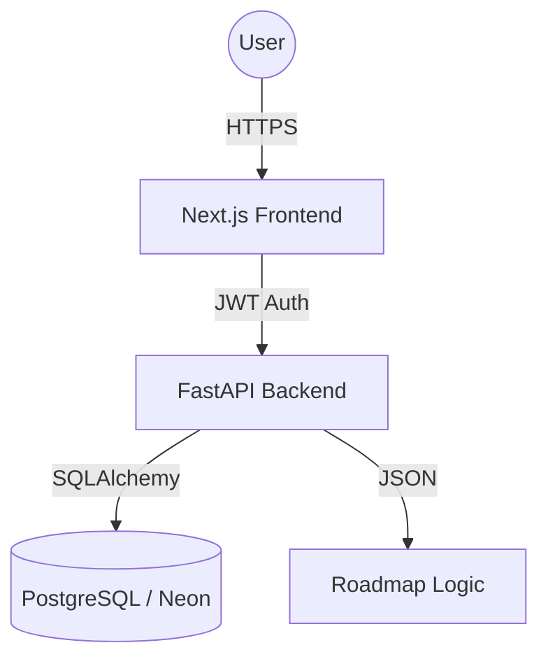

# 🚀 60-Day Hacker Tracker: Elite Performance System

[](https://github.com/nishantrs0404/60-day-hacker-tracker/blob/main/LICENSE)
[](https://github.com/nishantrs0404/60-day-hacker-tracker/stargazers)
[](https://fastapi.tiangolo.com/)
[](https://nextjs.org/)
[](https://www.docker.com/)

A premium, full-stack execution protocol designed for elite technical placement preparation. This system combines gamified psychology with a rigorous 60-day curriculum to ensure consistent high-performance output.

---

## 📸 System Interface

| **Executive Dashboard** | **Execution Protocol** |
|:---:|:---:|
|  |  |
| *Real-time XP, Levels, and Streak Tracking.* | *Locked progression system to maintain focus.* |

### 📖 Curriculum Roadmap

*A searchable, filtered architectural view of the entire 60-day syllabus.*

---

## 💎 Core Value Proposition

- **🧠 Cognitive Gamification**: Leverages XP-based leveling (Lv1 - Lv10) and streak mechanics to optimize dopamine loops for learning.
- **🔒 Disciplined Execution**: A strictly sequentially unlocked tracker ensures that foundational concepts are mastered before advanced architectures are explored.
- **📱 High-End DX/UX**: A state-of-the-art dark mode interface featuring glassmorphism, smooth Framer Motion animations, and responsive layouts.
- **📊 Performance Analytics**: Integrated velocity charts to monitor daily execution consistency.

---

## 🍴 Forking & Personalization

Want to use this system for your own learning goals or share it with your community? Follow these steps:

### 1. Fork the Repository
Click the **Fork** button at the top right of this page to create your own copy of the project.

### 2. Customize the Curriculum
You can change the 60-day plan to fit any subject (e.g., Web3, Cloud Arch, or UPSC prep).
- Open `backend/roadmap.json`.
- Modify the `title`, `dsa_task`, `ml_task`, etc., for each day.
- Re-run `docker-compose up --build` to automatically seed your new curriculum.

### 3. Change Branding
- Update the titles and icons in `frontend/src/app/layout.tsx` and `Navbar.tsx`.
- Adjust theme colors in `frontend/src/app/globals.css`.

---

## 🏗️ Technical Architecture



### Backend Foundation
- **FastAPI**: Asynchronous Python framework for high-concurrency API performance.
- **SQLAlchemy & Alembic**: Robust ORM and migration management for the PostgreSQL schema.
- **Passlib (Bcrypt)**: Industry-standard password hashing and security.

### Frontend Foundation
- **Next.js 16**: Utilizing App Router and Server Components for optimal SEO and performance.
- **Tailwind CSS v4**: Modern, utility-first styling with custom glassmorphism components.
- **Lucide React**: Clean, consistent iconography throughout the system.

---

## 🚀 Deployment & Local Setup

### Unified Docker Launch
The entire stack is containerized for "One-Command Deployment":

```bash
docker-compose up -d --build
```

### Access Points
- **System Portal**: `http://localhost:3000`
- **Interactive Documentation**: `http://localhost:8000/docs`
- **Database Explorer**: `http://localhost:5432` (via Docker)

---

## 📜 API Specification Summary

| Context | Endpoint | Method | Purpose |
|:---|:---|:---:|:---|
| Auth | `/api/auth/register` | `POST` | Account creation |
| Auth | `/api/auth/login` | `POST` | Secure JWT acquisition |
| Tracker | `/api/tracker/days` | `GET` | Retrieve 60-day protocol state |
| Tracker | `/api/tracker/progress/{id}`| `POST`| Commit daily execution results |

---

## 🌐 Enterprise Deployment
This project is engineered for cloud-native deployment:
1. **Database**: [Neon.tech](https://neon.tech) (Serverless Postgres).
2. **Backend**: [Render](https://render.com) (Docker Web Services).
3. **Frontend**: [Vercel](https://vercel.com) (Edge-optimized hosting).

---
*Developed by **[Nishant Raushan](https://github.com/nishantrs0404)** to redefine technical preparation standards.*
