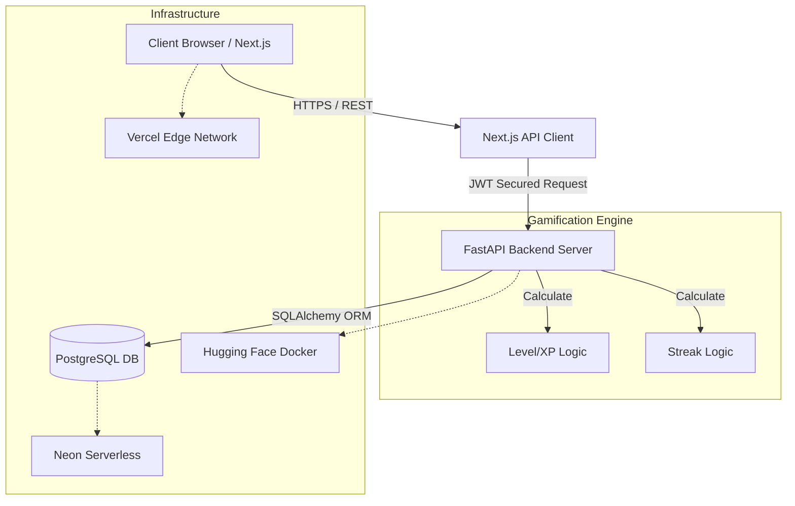

# 🚀 60-Day Hacker Tracker: Elite Performance System

[](https://github.com/nishantrs0404/60-day-hacker-tracker/blob/main/LICENSE)
[](https://github.com/nishantrs0404/60-day-hacker-tracker/stargazers)
[](https://fastapi.tiangolo.com/)
[](https://nextjs.org/)
[](https://www.docker.com/)
[](https://neon.tech/)

A premium, full-stack execution protocol designed for elite technical placement preparation. This system combines gamified psychology with a rigorous 60-day curriculum to ensure consistent high-performance output.

---

## 📑 Table of Contents
1. [🌐 Live Demo & Access](#-live-demo--access)
2. [📸 Visual Walkthrough](#-visual-walkthrough)
3. [💎 Core Psychology & Features](#-core-psychology--features)
4. [🏗️ Deep System Architecture](#-deep-system-architecture)
5. [🗄️ Database Schema Representation](#️-database-schema-representation)
6. [📜 Detailed API Specification](#-detailed-api-specification)
7. [💻 Local Development Guide](#-local-development-guide)
8. [🚀 Advanced Production Deployment](#-advanced-production-deployment)
9. [🍴 Forking & Personalization](#-forking--personalization)

---

## 🌐 Live Demo & Access

The project infrastructure is decoupled to allow maximum performance across specialized edge networks.

* **Frontend Dashboard (Vercel):** `[Your Vercel URL Here]`
* **Backend API (Hugging Face Space):** `[Your Hugging Face Space URL Here]`

*(If you are the repository owner, update the links above with your live endpoints once Vercel and Hugging Face deployments are complete).*

---

## 📸 Visual Walkthrough

| **Executive Dashboard** | **Execution Protocol** |
|:---:|:---:|
|  |  |
| *Real-time XP, Levels, and Streak Tracking.* | *Locked progression system to maintain focus.* |

### 📖 Curriculum Roadmap Overview

*A searchable, filtered architectural view of the entire 60-day syllabus without exposing completed tasks from the active tracker.*

---

## 💎 Core Psychology & Features

The system is not just a to-do list; it's a behavioral engine designed to maximize dopamine driven discipline:

- **🧠 Cognitive Gamification**: Leverages XP-based leveling (Lv1 - Lv10) and streak mechanics.
- **🔒 Disciplined Execution**: A strictly sequentially unlocked tracker ensures foundational concepts are mastered before advanced architectures are explored. You cannot skip days.
- **📱 High-End DX/UX**: A state-of-the-art dark mode interface featuring glassmorphism, Next.js hydration, smooth interactions, and fully responsive grid layouts.
- **📊 Real-time State Management**: Uses React context to provide instantaneous feedback on task completion without reloading.

---

## 🏗️ Deep System Architecture

The application implements a decoupled, heavily containerized architecture.



### ⚛️ Frontend Ecosystem `(frontend/)`
- **Framework**: `Next.js 16` leveraging the latest App Router.
- **Styling Engine**: `Tailwind CSS v4` using a highly customized root CSS variable set for seamless dark-mode matching.
- **State Control**: Custom React `AuthContext` managing JWT tokens and synchronizing user data (XP, Level, Current Day) across the tree.
- **Data Fetching**: Extracted `axios` instances with automatic token injection.

### 🐍 Backend Ecosystem `(backend/)`
- **Framework**: `FastAPI` (Python 3.11) built for raw asynchronous speed.
- **Security**: OAuth2 with Password Flow. Passwords are mathematically salted and hashed using `bcrypt<4.1`.
- **Database Mapping**: `SQLAlchemy` acting as the ORM, abstracting pure SQL.
- **Schema Validation**: Extensive use of `Pydantic v2` models for strict typing.

---

## 🗄️ Database Schema Representation

Understanding the data relationships:

1. **`users` Table**:
   - Stores identity credentials (hashed password, email, username).
   - Tracks global gamification metrics (`total_xp`, `level`, `current_streak`, `last_completed_day`).
2. **`days` Table**:
   - The master curriculum list (Day 1 -> 60). Seeded systematically.
   - Distinct columns for domain tasks: `dsa_task`, `ml_task`, `dev_task`, `deploy_task`.
3. **`user_progress` Table (Junction/Tracking)**:
   - Relational mapping between a `user_id` and a `day_number`.
   - Tracks granular execution state (`dsa_completed`, `ml_completed`, etc.) via booleans.

---

## 📜 Detailed API Specification

The RESTful implementation ensures clean client-server boundaries. Check `http://localhost:8000/docs` locally for interactive Swagger documentation.

| Category | Endpoint | Method | Security | Payload / Query | Description |
|:---|:---|:---:|:---:|:---|:---|
| **Auth** | `/api/auth/register` | `POST` | Public | JSON (`UserCreate`) | Registers a new user and hashes password. |
| **Auth** | `/api/auth/login` | `POST` | Public | OAuth2 Form (`username`, `password`)| Returns JWT `access_token`. |
| **Auth** | `/api/auth/me` | `GET` | Bearer | `None` | Returns verified user identity + XP. |
| **Tracker** | `/api/tracker/days` | `GET` | Bearer | `None` | Returns the entire 60 day roadmap integrated with the user's specific completion matrix. |
| **Tracker** | `/api/tracker/progress/{id}`| `POST` | Bearer | JSON (`ProgressUpdate`) | Completes tasks, triggers XP calculation, updates streaks, unlocks next day if 100%. |

---

## 💻 Local Development Guide

The entire software pipeline is containerized to avoid "it works on my machine" syndromes.

### 1. Prerequisites
- Docker Engine and Docker Compose.

### 2. Ignition
Navigate to the root directory and build the stack:
```bash
docker-compose up -d --build
```
*Note: The backend container executes a `wait-for-db` script to guarantee PostgreSQL readiness before automatically seeding the database.*

### 3. Verification
- **Frontend App**: `http://localhost:3000`
- **Backend API**: `http://localhost:8000/docs`
- **Database**: Port `5432`

---

## 🚀 Advanced Production Deployment

This stack features native support for high-tier serverless cloud providers.

### 1. Database (Neon Serverless)
Obtain a Postgres URI from [Neon.tech](https://neon.tech/) and safely store it.

### 2. Backend API (Hugging Face Spaces)
The root level `Dockerfile` is uniquely optimized for automated deployment on Hugging Face Spaces (a completely free, high-performance Docker host).
- Create a new "Docker" Space on HF.
- Connect your GitHub Repository to the Space.
- Add Secrets in HF Settings: `DATABASE_URL`, `SECRET_KEY`, `ALGORITHM` (HS256), `ACCESS_TOKEN_EXPIRE_MINUTES`.

### 3. Frontend UI (Vercel)
- Create a New Project on [Vercel](https://vercel.com/) linked to your repository.
- Root folder: `frontend/`.
- Add Environment Variable: `NEXT_PUBLIC_API_URL` pointing to your deployed Backend URL (ensure it suffixes with `/api`).

---

## 🍴 Forking & Personalization

You are encouraged to fork this architecture to build your own discipline engines (e.g., *100 Days of Web3*, *30 Days of AWS*).

1. **Fork the Repo** via GitHub.
2. **Curriculum Engineering**: Open `backend/roadmap.json` and structurally redefine the daily objectives.
3. **Database Re-seeding**: Run `docker-compose down -v` followed by `docker-compose up --build` to wipe the old PG Volume and seed your newly engineered roadmap.
4. **Brand Extraction**: Modify the globally scoped CSS variables in `frontend/src/app/globals.css` and rewrite the brand headers in `Navbar.tsx`.

---
**Architected by [Nishant Raushan](https://github.com/nishantrs0404) to standardize rigorous technological execution.**
